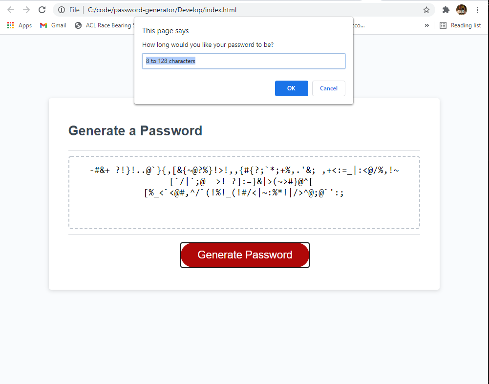

# Password-Generator

This website was designed to allow users to create a random secure password using a set of user-defined parameters. The user has the option of selecting which characters they would like to construct their password from: lower case letters, upper case letters, numbers, or special characters. The password generated can vary in length from 8 characters to 128 characters.

## Validation

The Javascript checks to ensure that the user has input necessary information needed to generate a password: a number between 8 and 128, and has selected at least one type of character to use.

## Functionality

The website functions around the use of preset character strings that are then combined given the input from the user. Once this string of usable characters has been created a FOR loop is used to generate a random number, a character from the combined string is selected based on this location, and this character is appended to the users password. The FOR loop ends when the desired password length has been reached.

Check internal comments for more details.

## Website in Action

The page can be found live at: https://trev-eck.github.io/password-generator/